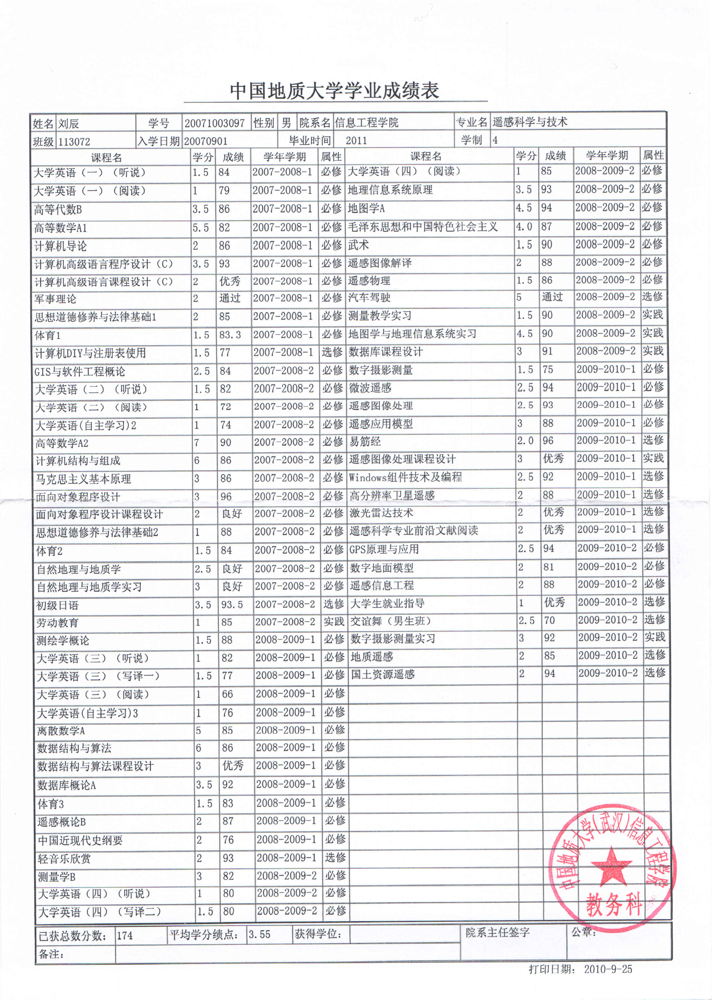
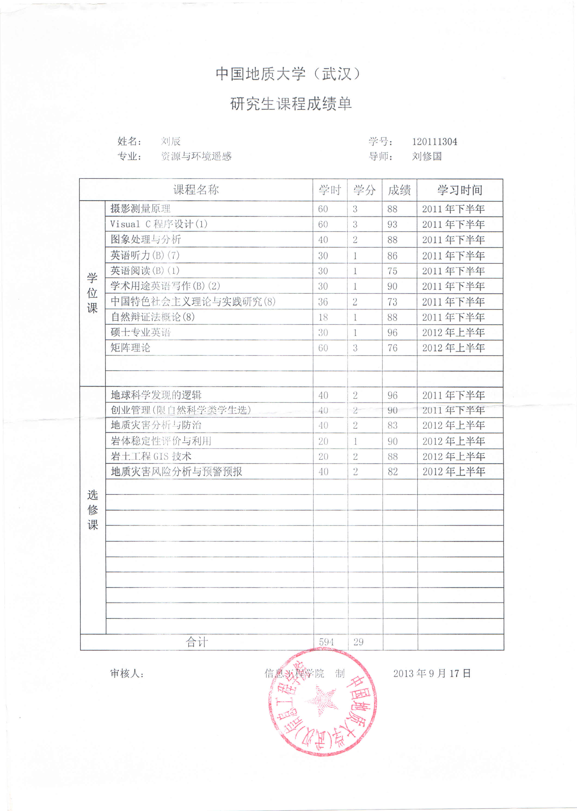
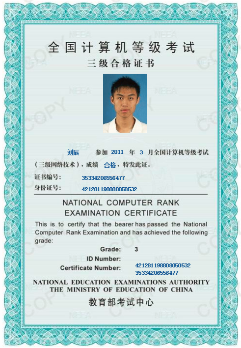

# 附件资料

## 负责并参与的项目

### 基于CPU+GPU高性能计算的环境遥感监测系统（2014/09 ~ 2016/09） 
 - 项目描述：项目属于2014年度武汉市科技型中小企业技术创新基金项目，CPU+GPU系统弥补了传统串行遥感数据处理系统效率上的不足，对环境保护及国家可持续发展有着重大意义。主要包括大气、水、海洋、生态、地质灾害以及固体废弃物环境监测功能。
 - 关键技术：大规模并行处理技术、海量数据快速存取与管理、快速可视化数据建模、CPU+GPU影像数据自动分割处理、数据分配负载均衡策略。

### 线性工程地质灾害防治信息平台（2016/07 ~ 2018/01）
 - 项目描述：基于开源QGIS平台，对企业线性管道、地质灾害、矿产资源等数据入库管理，搭建信息化管理平台，供企用户对数据进行检索、浏览、分析。高度信息化企业日常工作流程，企业用户日常办公、考勤、审批、外业作业等业务全部通过信息系统进行管理。企业项目合同、经营情况、首付款情况也通过系统进行管理，便于领导掌握企业整体状况。
 - 关键技术：采用ASP.NET MVC搭建web服务系统，数据库为PostgreSQL - PostGIS，Android版外业App。其他技术包括JavaScript、Openlayers、easyUI、highcharts、QGIS Server、GDAL/OGR……   

### 震后趋势判定与风险评估系统（2015/12 ~ 2018/03）
 - 项目描述：通过编写爬虫程序，自动抓取地震目录信息。针对新发生的地震，自动创建震情报告、制作专题图，并将报告推送到Android手机端。针对历史地震，进行时空分析、断层三维分析、震源机制分析、生成风险评估专题图。
 - 关键技术：采用java在Linux Fedora上搭建web服务系统，采用geoserver发布地图数据，采用Casperjs开发爬虫程序抓取网站上的地震记录，利用python绘制地质专题图，数据库为PostgreSQL - PostGIS。其他技术包括Android、JavaScript、Openlayers、easyUI、nodejs、phantomjs、threejs以及gdal、numpy、scipy、matplotlib、basemap等python库。 

### 联投GIS平台（2015/12 ~ 2017/12）
 - 项目描述：用友NC平台负责项目管理，我方开发的GIS平台负责图形化展现及相关空间分析。平台将规划设计、土地使用、征地拆迁、工程投资及建设进度等相关数据及时录入，采用表格与图像相结合方式，实时、全面反映整个新城板块建设进展情况。实现集团建设项目的成本管控、工程招投的监控管理、集团土地储备管理、重大项目的规划设计管理等工作，并全面推进建设管理系统化、精细化、信息化。
 - 关键技术：采用.NET搭建web服务系统，基于开源QGIS、QT利用C++语言开发C/S客户端编辑图形数据，数据库为Oracle。其他技术包括JavaScript、Openlayers、easyUI、highcharts、QGIS Server……

### 武汉市大气污染源排放清单管理系统（2015/12 ~ 2016/12）
 - 项目描述：系统项目以地理信息技术为支撑，以服务于武汉市环境保护科学研究院的数据采集电子化、数据统计分析实时化、数据展示形象直观为目标的重要信息化手段。
 - 关键技术：采用java在Linux CentOS上搭建web服务系统，采用geoserver发布地图数据，数据库为MySQL。其他技术包括JavaScript、Openlayers、easyUI等。

### 多模式解释应用集成预测系统（MODES）（2014/09 ~ 2015/09）
 - 项目描述：将多模式解释应用集成预测方法得到的气象预测数据，通过python自动绘图进行可视化展现，并搭建展示网站集成到中国气象局国家气候中心管网。
 - 关键技术：采用PHP语言在Linux Ubuntu上搭建web服务系统，利用python读取并可视化展现气象预测数据，数据库为MySQL。其他技术包括numpy、matplotlib、basemap、scipy、pandas等python库。 项目网址：[http://cmdp.ncc-cma.net/modes/](http://cmdp.ncc-cma.net/modes/)

### APOLLO海量影像管理系统（2014/07 ~ 2015/12）
 - 项目描述：基于ERDAS Apollo影像管理平台，对新疆二院卫星遥感数据入库，搭建海量影像管理系统，供用户对数据进行检索、浏览、分析、发布、下载等操作。
 - 关键技术：通过java开发影像解析器，采用.NET搭建web服务系统，数据库为Oracle。其他技术包括JavaScript、Openlayers、ExjJS、GDAL/OGR……

### 排水信息化管理系统（2014/05 ~ 2015/12）
 - 项目描述：基于MapGIS平台，对渝西管网数据入库管理，搭建信息化管理系统，供企业用户对管网数据进行检索、浏览、分析。同时该系统对企业日常工作流程高度信息化，企业用户日常办公、考勤、审批、外业巡检等业务全部通过该信息系统进行管理。
 - 关键技术：采用ASP.NET MVC搭建web服务系统，数据库为SQL Server，Android版外业巡检App。其他技术包括JavaScript、Openlayers、ExjJS、highcharts、MapGIS Server……

## 大学课程

### 本科成绩单

### 研究生成绩单

## 证书情况

### 全国计算机等级考试三级

### 全国信息化工程师

### 大学英语六级

### 初级程序员

### 大学英语四级

## 论文及专利

### EI检索
[百度学术页](http://xueshu.baidu.com/s?wd=paperuri%3A%28ad8a5a65a5312ddf4a1c9e5006330d6d%29&filter=sc_long_sign&sc_ks_para=q%3DImpact%20analysis%20of%20different%20spatial%20resolution%20DEM%20on%20object-oriented%20landslide%20extraction%20from%20high%20resolution%20remote%20sensing%20images&sc_us=10021676106101439353&tn=SE_baiduxueshu_c1gjeupa&ie=utf-8) &emsp;&emsp; [论文pdf](papers/EI检索.pdf)

### 中文核心
[百度学术页](http://xueshu.baidu.com/s?wd=paperuri%3A(eb3f1fb2c0028fb40e29f469a3f58db2)&filter=sc_long_sign&tn=SE_baiduxueshu_c1gjeupa&ie=utf-8&sc_ks_para=q%3D%E9%9D%A2%E5%90%91%E5%AF%B9%E8%B1%A1%E6%BB%91%E5%9D%A1%E4%BF%A1%E6%81%AF%E6%8F%90%E5%8F%96%E4%B8%ADDEM%E7%A9%BA%E9%97%B4%E5%88%86%E8%BE%A8%E7%8E%87%E5%BD%B1%E5%93%8D%E5%88%86%E6%9E%90) &emsp;&emsp; [论文pdf](papers/中文核心.pdf)

### 专利
[万方数据页](http://www.wanfangdata.com.cn/details/detail.do?_type=patent&id=CN201410478027.1) &emsp;&emsp; [专利来源：硕士论文第三章](papers/硕士论文-面向对象遥感滑坡信息提取技术研究.pdf)

## 荣誉奖项

### 挑战杯省赛金奖&优胜团队

### 挑战杯国赛铜奖

