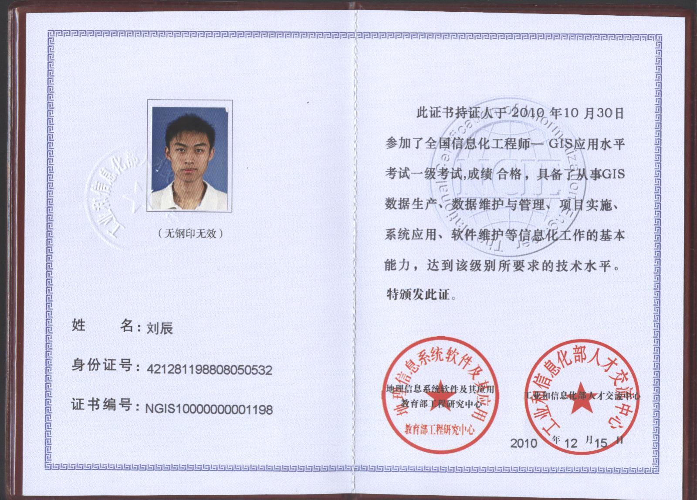
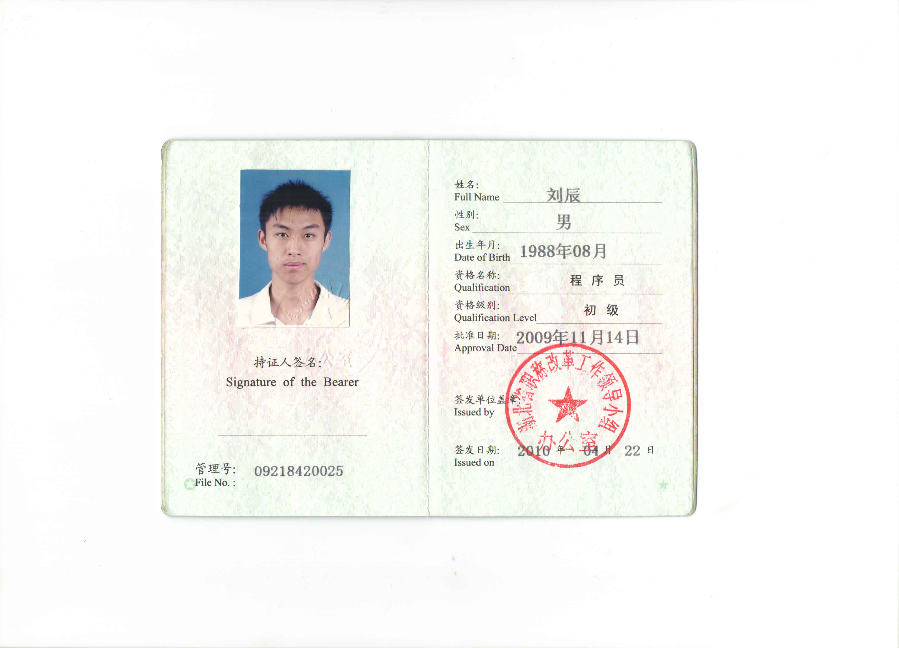
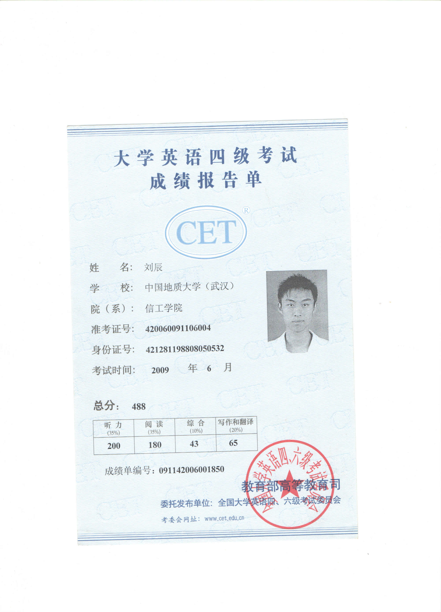
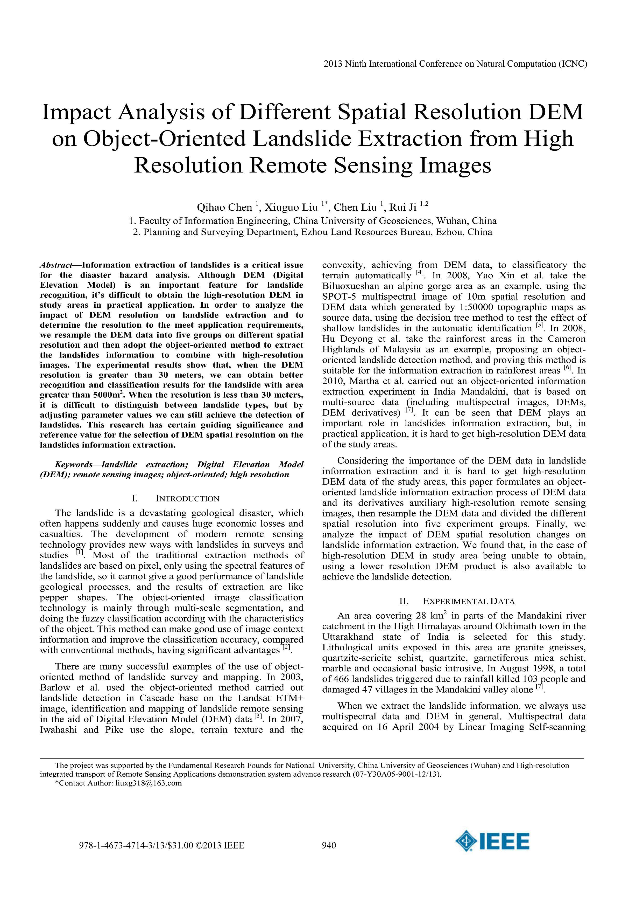
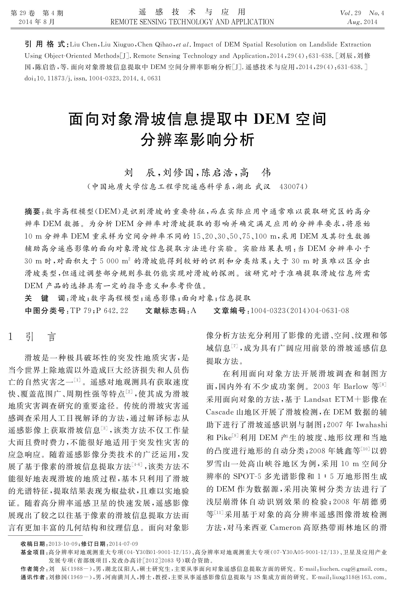
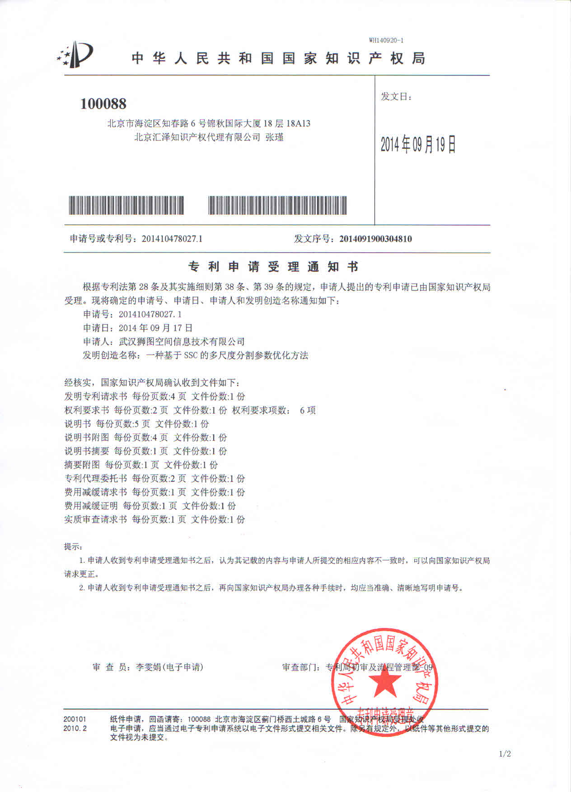
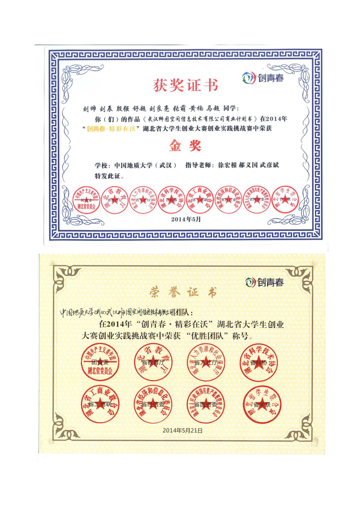
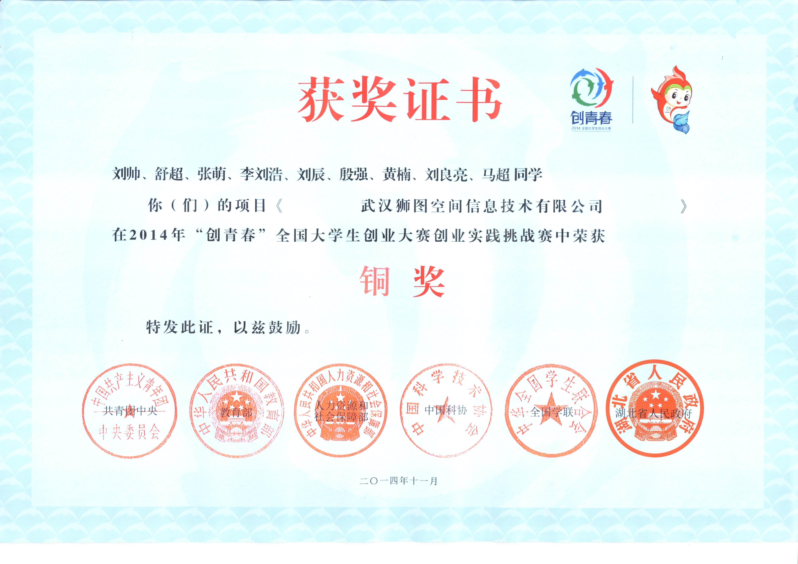

# 附件

## 证书情况
### 全国计算机等级考试三级

### 全国信息化工程师

### 大学英语六级

### 初级程序员

### 大学英语四级

## 论文及专利
### EI检索
[百度学术页](http://xueshu.baidu.com/s?wd=paperuri%3A%28ad8a5a65a5312ddf4a1c9e5006330d6d%29&filter=sc_long_sign&sc_ks_para=q%3DImpact%20analysis%20of%20different%20spatial%20resolution%20DEM%20on%20object-oriented%20landslide%20extraction%20from%20high%20resolution%20remote%20sensing%20images&sc_us=10021676106101439353&tn=SE_baiduxueshu_c1gjeupa&ie=utf-8) &emsp;&emsp; [论文pdf](papers/EI检索.pdf)

### 中文核心
[百度学术页](http://xueshu.baidu.com/s?wd=paperuri%3A(eb3f1fb2c0028fb40e29f469a3f58db2)&filter=sc_long_sign&tn=SE_baiduxueshu_c1gjeupa&ie=utf-8&sc_ks_para=q%3D%E9%9D%A2%E5%90%91%E5%AF%B9%E8%B1%A1%E6%BB%91%E5%9D%A1%E4%BF%A1%E6%81%AF%E6%8F%90%E5%8F%96%E4%B8%ADDEM%E7%A9%BA%E9%97%B4%E5%88%86%E8%BE%A8%E7%8E%87%E5%BD%B1%E5%93%8D%E5%88%86%E6%9E%90) &emsp;&emsp; [论文pdf](papers/中文核心.pdf)

### 专利
[万方数据页](http://www.wanfangdata.com.cn/details/detail.do?_type=patent&id=CN201410478027.1) &emsp;&emsp; [专利来源：硕士论文第三章](papers/硕士论文-面向对象遥感滑坡信息提取技术研究.pdf)

## 荣誉奖项
### 挑战杯省赛金奖&优胜团队

### 挑战杯国赛铜奖

